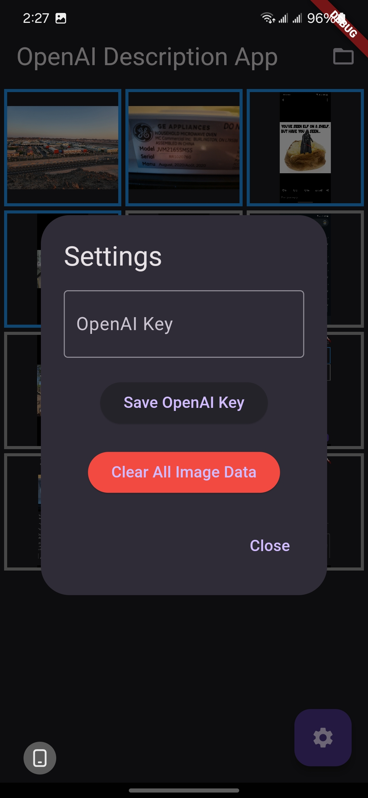
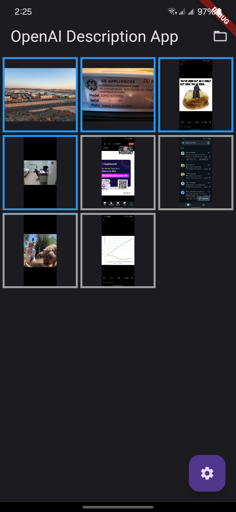
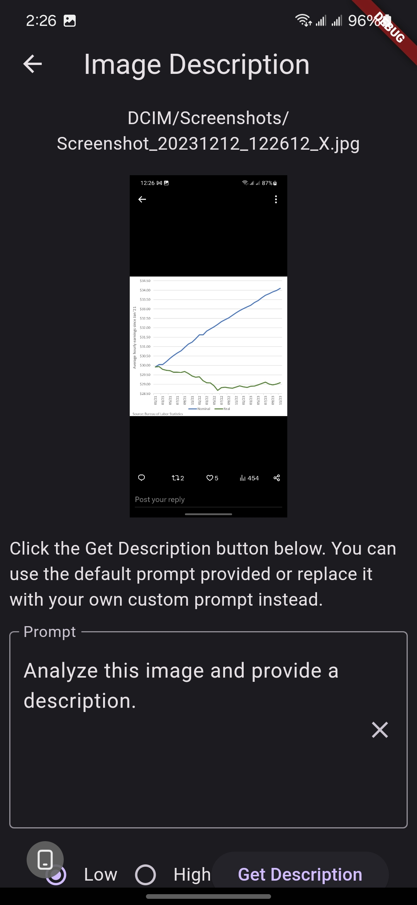
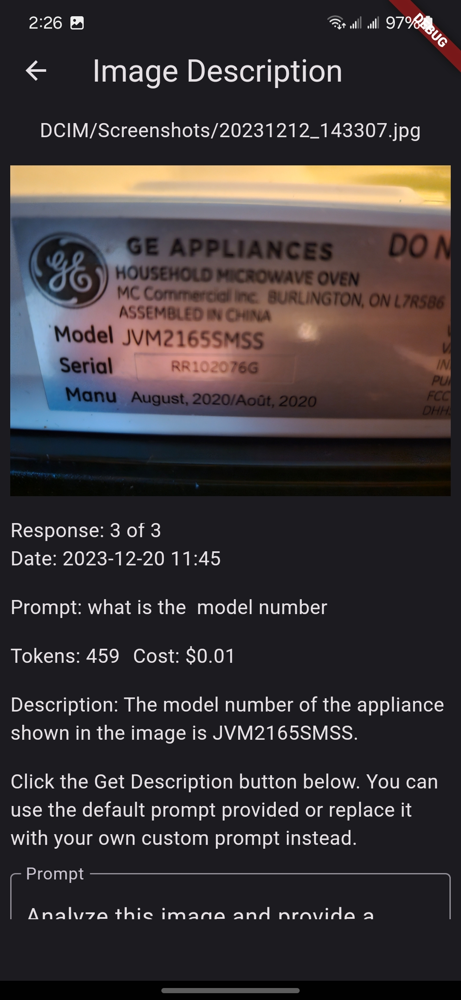
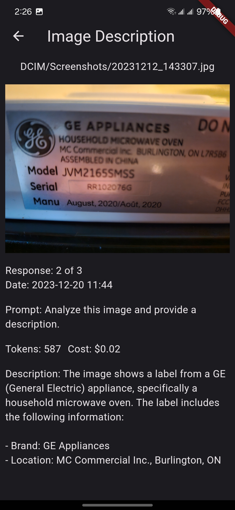

# Flutter OpenAI Image Description App

This is a simple Android Flutter app that uses OpenAI ChatGPT-4-Vision API to get descriptions of images on mobile device. 

For example, send screenshot of Tweet chart or meme to OpenAI to get a description or answer questions about the image. 

Prompts, responses, datetime, tokens used and estimated cost are saved in JSON file. Can have more than one response per image.

* Rename lib/config_template.dart to config.dart template.
* You need to provide your own OpenAI API key. 

<strong>App screenshots</strong>

Enter API Key - saved in JSON file in Android app folder

Selected folder image thumbnails - blue bordered images have at least one response

Selected image prompt - modify text prompt as desired, default to low resolution (good enough for  most)

Selected image prompt response 1 - can get more than one response each with different prompt and/or resolution

Selected image prompt response 2

## License

This project is licensed under the [NAME HERE] License.

## Acknowledgments

ChatGPT-4-Turbo